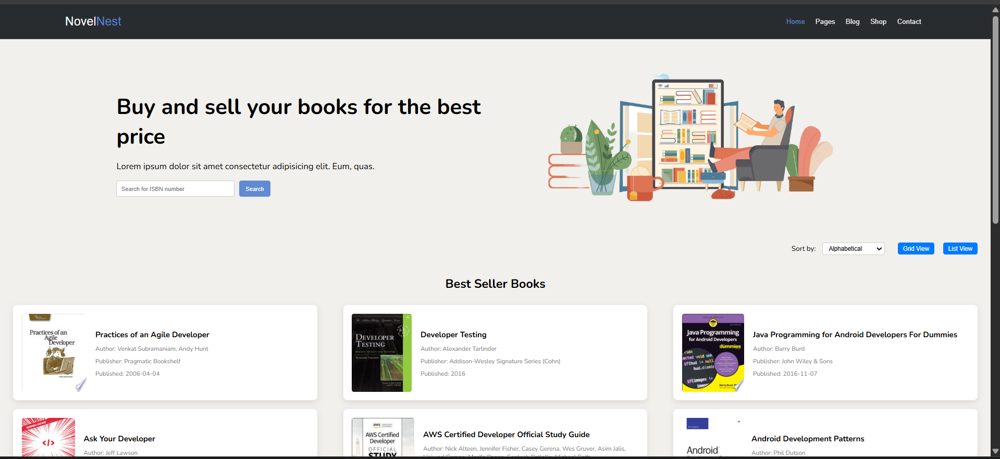

# NovelNest - (BookLibrary)

- A Book Library website built using FreeAPI.app that dynamically fetches and displays book data in a user-friendly interface. This project helps in practicing API requests, handling JSON data, and rendering dynamic content using JavaScript.

##  Live Demo  

[Click here to view the live project](https://mg-quote-generator.netlify.app/)

## Features

- Fetch Books from API - Dynamically loads book data from FreeAPI.app.

- List/Grid View Toggle - Users can switch between list and grid views.

- Book Details Display - Shows title, author, publisher, published date, and thumbnail.

- Search Functionality - Users can search books by title or author.

- Sorting Feature - Books can be sorted in: Alphabetical order (A-Z) by title. Date of release (publishedDate).

## How to Use

- Browse Books - Books are dynamically loaded from the API.

- Search Books - Use the search bar to filter books by title or author.

- Sort Books - Sort books alphabetically or by published date.

- Toggle View - Switch between list and grid views.

- Pagination - Scroll down to load more books dynamically.

- View Details - Click on a book to view more details in a new tab.

## 📸 Preview

## Technologies Used

- HTML - Structure of the webpage.

- CSS - Styling for a modern UI.

- JavaScript - Fetching API data, dynamic UI updates, and button functionalities.

- Free API - Fetching Books.

##  Installation & Usage

- Clone this repository:

- Navigate to the project folder:

- Open index.html in your browser and enjoy! 